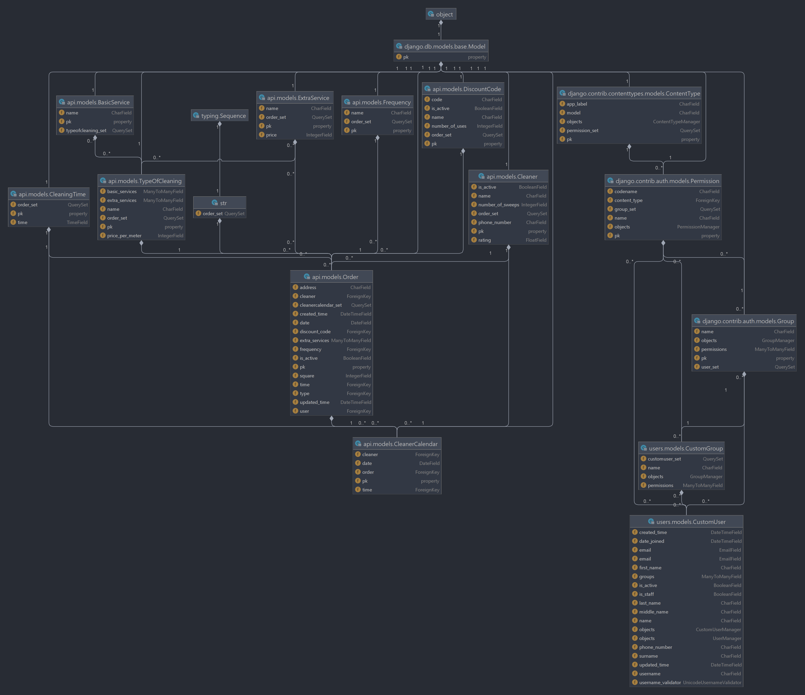

# Cleaning Django 
____

## Сервис для заказа уборки квартир

Реализовал в рамках дисциплины инженерного проектирования 

Студент группы 191-321 Буртелов Вадим Михайлович

## Рабочая версия
[Админка](http://cleaning.std-1887.ist.mospolytech.ru/admin)

Доступные учетные записи

| Тип пользователя | Почта          | Пароль |
| ---------------- | -------------- | ------ |
| Админ            | admin@admin.ru | 123456 |
| Пользователь     | user@user.ru   | 123456 |


## Схема БД



## Установка
```sh
$ git clone https://github.com/vburtelov/CleaningDjango.git
```
* В корне проекта создайте виртуальное окружение и активируйте его
```sh
$ python -m venv “venv”
$ .\venv\Scripts\activate (для Unix: source ./venv/bin/activate)
```
#### Все последующие действия производить внутри виртуального окружения

* Установите все необходимые зависимости для работы Django

```sh
$ pip install -r requirements.txt
```

* Установите все необходимые миграции, убедитесь, что был создан файл db.sqlite3

```sh
$ python manage.py makemigrations
$ python manage.py migrate
```

* Создайте суперпользователя для работы с админкой

```sh
$ python manage.py createsuperuser
```

* Запустите проект

```sh
$ python manage.py runserver
```
